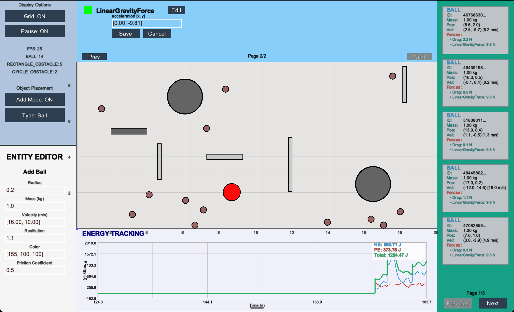
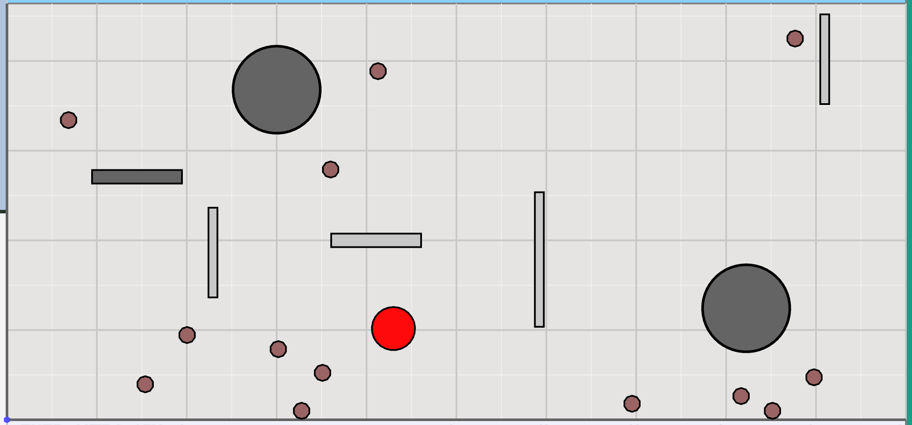
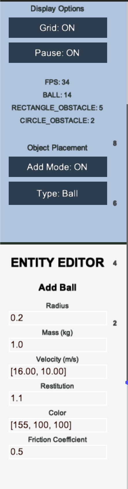
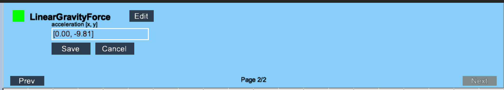
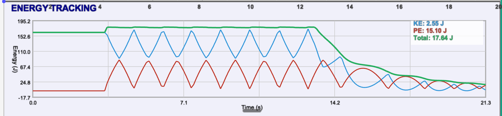
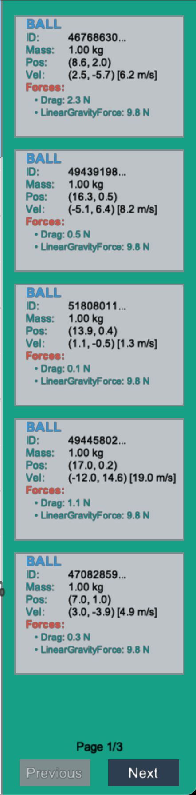

# ViewPort (center)
- Main view on the simulation

# Control Panel (Left)

## Controls
- Pause
- Display Grid

## Debugs
- FPS
- Entitys count

## Entity Editor
- Add Entity / Edit Parameters
- Place them by click on ViewPort

# Force Manager (Top Center)

- Allows to activate/deactivate forces
- Allows to edit force parameters / calculations models

# Energy Manager (Bottom Center)

- Displays Plots of Potential and Kinectc energy over time

# Inventory Panel (Right)

- Allows to see paramenters of all entities in simulation.
